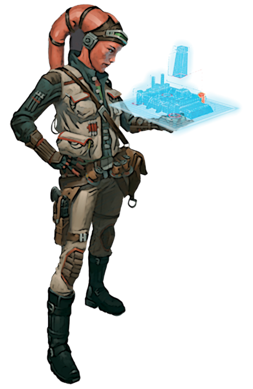

# Explorer Pursuit

The explorer strives to navigate past the known to discover new planets, forgotten ruins, or forbidden locations. Those scholars who choose the Explorer Pursuit spend their time studying maps, landmarks, architecture blue prints, or even history books, using them to effectively lead the way for their companions.

## Focused Navigator
_**Explorer Pursuit:** 3rd level_ 
You gain proficiency in two of the Perception, Piloting, Survival, and Acrobatics skills. Additionally, you can't have disadvantage on checks you make with them.

## Surveyed Area
_**Explorer Pursuit:** 3rd level_ 
You can now use your Critical Analysis feature on a 15-foot cube area within 60 feet of you that you can see. You can treat any creatures inside this cube as if they are the target of your Critical Analysis feature, and when a creature ends your Critical Analysis feature on themself, it does not end this effect for other creatures in your Surveyed Area. 

## Field Advantage
_**Explorer Pursuit:** 6th level_ 
You learn to quickly convey spatial information in the midst of combat about the area you analyzed, giving them an edge at maneuvering in the area. While moving through your Surveyed Area, you and friendly creatures of your choice ignore unenhanced difficult terrain, and opportunity attacks against them are made with disadvantage.

## Unstoppable Adventurer
_**Explorer Pursuit:** 9th level_ 
You learn to swim and scale vertical surfaces with ease. You gain swimming and climbing speed equal to your walking speed.

Additionally, your Sage Advice feature can be used to give friendly creatures knowledge on how to swim or climb, provided you have a swimming or climbing speed. Chosen creatures have a swimming speed or climbing speed for the entire duration.

## Survey Master
_**Explorer Pursuit:** 17th level_ 
When you use the Surveyed Area feature, the area affected is a 30-foot cube instead of a 15-foot cube.

___

## Explorer Discoveries
When you select this pursuit, you gain access to new discoveries which reflect your studies in maps and hidden routes. Whenever you learn a new discovery, you can choose from any of the following as well. The discoveries are listed in alphabetical order.

### Cover Adept
_**Prerequisite:** 12th level_ 
You treat one-quarter cover as half cover, half cover as three-quarters cover, and three-quarters cover as full cover. Additionally, while you are in cover, Dexterity (Stealth) checks you make gain a bonus equal to your Critical Analysis ability modifer (minimum of +1).

### Dungeon Explorer
You have advantage on Wisdom (Perception) checks and Intelligence (Investigation) checks to locate any secret doors or traps, and you have resistance to damage dealt by traps.

Additionally, you can use your Sage Advice feature to teach friendly creatures about various types of traps, following the same rules of that feature. When you do so, the chosen creatures have resistance to damage dealt by traps.

### Galactic Explorer
_**Prerequisite:** 9th level_ 
When you make an Intelligence (Piloting) check and add your proficiency bonus to the check, treat any roll of 9 or lower as if you had rolled a 10. 

### Grappling Hunter
_**Prerequisite:** 5th level_ 
Attack rolls that you make against creatures that you are grappling have advantage. 

### High Ground
_**Prerequisite:** 5th level_ 
Once per turn, when you or a friendly creature hits a creature that is a target of your Critical Analysis feature, it takes additional damage equal to half your Critical Analysis ability modifer (minimum of +1). 

### No Stone Left Unturned
When you make a Wisdom (Perception) or Intelligence (Investigation) check to find a hidden creature that is inside the area that is targeted by your Critical Analysis feature, you do so with advantage. 

### Versatile Explorer
You can hold your breath twice as long as you are normally able to, and take half as much damage from fall damage.
