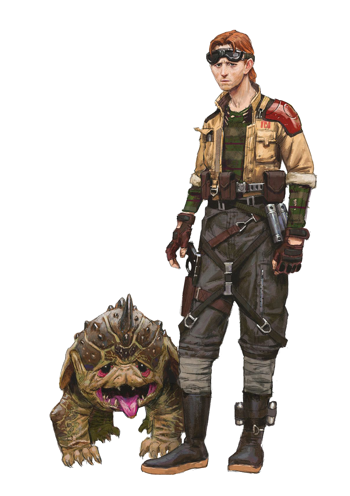

# Zoologist Pursuit

Many academics develop an affinity for nature, studying the vast fauna that inhabit the different planets throughout the galaxy. Those scholars who choose the Zoologist Pursuit capitalize on their knowledge of animals, developing a strong bond with a companion with whom they gain an advantage on the battlefield.

## Wilderness Expert
_**Zoologist Pursuit:** 3rd level_ 
You gain proficiency in Animal Handling, and you have advantage on Wisdom (Animal Handling) checks. Additionally, you can't have disadvantage on Wisdom (Animal Handling) checks.

## Beast Companion
_**Zoologist Pursuit:** 3rd, 11th, and 17th level_ 
You learn to employ all the knowledge you've accumulated to forge a powerful bond with your own beast companion.

Create your beast companion as detailed in the Companions section of the Customization Options document for Expanded Content. 

In addition to its traits and features, your beast companion gains additional benefits while it is bonded to you:
- Your beast gains two additional traits. It gains one more additional trait when you reach 11th level in this class. For each beast trait in excess of your proficiency bonus, your number of available Hit Dice that can be spend to restore hit points is reduced by 1.

Lastly, while bonded and within 10 feet of you, your beast companion gains a bonus to ability checks, armor class, attack rolls, damage rolls, and saving throws equal to half your Critical Analysis ability modifer (minimum of +1).

This radius increases to 30 feet at 11th level, and 60 feet at 17th level.

## Vicious Hunting
_**Zoologist Pursuit:** 6th level_ 
Your beast companion's strikes count as enhanced for the purpose of overcoming resistance and immunity to unenhanced attacks and damage. Additionally, when your beast makes an attack roll, ability check, or saving throw, you may expend a superiority die and apply the benefits of a maneuver you know from this class, as if you had taken the action yourself.

## Bestial Agility
_**Zoologist Pursuit:** 9th level_ 
Your beast's reflexes and agility allow it to move with a burst of speed. When your beast moves on its turn in combat, it can double its speed until the end of the turn. Once its used this feature, it can't use it again until it moves 0 feet on one of its turns.

## Feral Ferocity
_**Zoologist Pursuit:** 17th level_ 
You have learned how to push your beast beyond its limits. If your beast is within 30 feet of you and can see or hear you, you can command it to enter a furious state. While raging, your beast gains the following benefits:
- Your beast has advantage on Strength checks and Strength saving throws if it is size Medium or larger.
- Your beast has advantage on Dexterity checks and Dexterity saving throws if it is size Small or smaller.
- When your beast hits with an attack, it deals bonus damage equal to your Critical Analysis ability modifer.
- Your beast has resistance to kinetic and energy damage.

Your beast's furious state lasts for 1 minute. It ends early if your beast is knocked unconscious. You can end your beast's furious state as a bonus action.

Once you've used this feature, you can't use it again until you finish a long rest.

## Zoologist Discoveries
When you select this pursuit, you gain access to new discoveries which reflect your studies in biology and behaviour of alien lifeforms. Whenever you learn a new discovery, you can choose from any of the following as well. The discoveries are listed in alphabetical order.

### Advantageous Companion
When you make a Charisma (Intimidation) check against a creature that can see your beast companion, and your companion is size Medium or larger, you make the check with advantage.

When you make a Charisma (Persuasion) check against a creature that can see your beast companion, and your companion is size Small or Tiny, you make the check with advantage.

### Holocam Attachment
You have learned how to safely attach a holocam on the head of the companion. You learn the *tracker droid interface* tech power, your beast becomes a valid target of this power, and when you cast this power targeting your beast, you do so without spending tech points. You require use of a wristpad for this power.

### Neat Tricks
_**Prerequisite:** 5th level_ 
Your beast gains proficiency in one Strength or Dexterity skill of your choice. If your beast's size is Medium or larger and the chosen skill uses Strength, it has expertise in the chosen skill. If your beast's size is Small or smaller and the chosen skill uses Dexterity, it has expertise in the chosen skill.

### One Big Baddie
_**Prerequisite:** Size Medium or larger beast_ 
Your beast companion gains the following benefits:
- It deals double damage against structures.
- It can take the Guard action as a bonus action, but it can only guard you in this way.
- It can spend a bonus action to spend one of its Hit Dice to recover hit points.
- When it rolls a Hit Die to regain hit points, the minimum number of hit points it can regain from the roll equals twice its Constitution modifier (minimum of 2).

### Protective Friend
If a creature makes a melee attack against you or your companion, and your companion is within 5 feet of you, you can use your reaction to impose disadvantage on the attack roll.

### The More the Merrier
_**Prerequisite:** Size Small or smaller beast_ 
Rather than a single beast companion, you instead control multiple beasts that function as a swarm. Your beast companion gains the following benefits:
- Its effective size increases by two categories (from Tiny to Medium or Small to Large).
- Its hit points increase by an amount equal to twice its level + 2.
- It can only be mounted by creatures at least three size categories smaller than it, instead of one.
- It can occupy another creature's space and vice versa, and it can move through any opening large enough for a creature two size categories smaller than it.
- While it is above half its hit point maximum, when it takes the Attack action, it can make an additional attack. If the creature has the Extra Attack feature, this attack is in addition to the attack granted by that feature.
