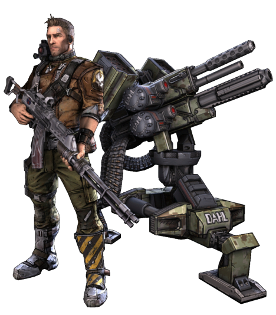

# Artillerist Technique (Companion)

While some scouts choose to foray alone, others like to have support. Followers of the Artillerist Technique master control of militant constructs, laying waste to the battlefield with their expertise

## Bonus Proficiencies
_**Artillerist Technique:** 3rd level_ 
You gain proficiency in artillerist's implements.

## Turret Companion
_**Artillerist Technique:** 3rd, 11th, and 17th level_ 
You learn to apply your knowledge to construct and bond with your own portable turret.

Create your turret companion as detailed in the Companions section of the Customization Options document for Expanded Content. You must have artillerist's implements in order to create your turret.

In addition to its traits and features, your turret companion gains additional benefits while it is bonded to you:
- Your turret is a valid target of the *tracker droid interface* tech power.
- Your turret gains two additional traits. It gains one more additional trait when you reach 11th level in this class. For each turret trait in excess of your proficiency bonus, your tech point maximum is reduced by 1. Over the course of a long rest, you can install, replace, or remove a number of turret traits equal to half your Intelligence modifier (rounded up, minimum of one).
- When you would make a weapon attack, you can let your turret make a weapon attack instead.

Lastly, while your turret is bonded, within 10 feet of you, and the target of your *tracker droid interface* tech power, when you cast a tech power with a range of 5 feet or greater, you can cast it as if you were in your turret's space, and the range increases to 10 feet if it isn't greater.

Both the range and radius increase to 30 feet at 11th level, and 60 feet at 17th level.

## Mark of the Artillerist
_**Artillerist Technique:** 3rd level_ 
Once per round, when your turret deals damage to the target of your Ranger's Quarry, you can roll your Ranger's Quarry die and add it to the damage roll.

## Crisis Management
_**Artillerist Technique:** 7th level_ 
While you can see your turret, it can add half its proficiency bonus to any saving throws it makes that doesn't already include it.

## Double Up
_**Artillerist Technique:** 11th level_ 
When you deal damage to a creature with a weapon or tech power, your turret has advantage on the next attack roll it makes against the creature or it has disadvantage on the first saving throw it makes against an effect your turret controls before the start of your next turn. When your turret deals damage to a creature, you have advantage on your next attack roll against the creature or it has disadvantage on the first saving throw it makes against an effect you control before the start of your next turn.

## Battlefront
_**Artillerist Technique:** 15th level_ 
When you use your Combat Tech feature, both you and your turret can each make one weapon attack as part of the same bonus action.
