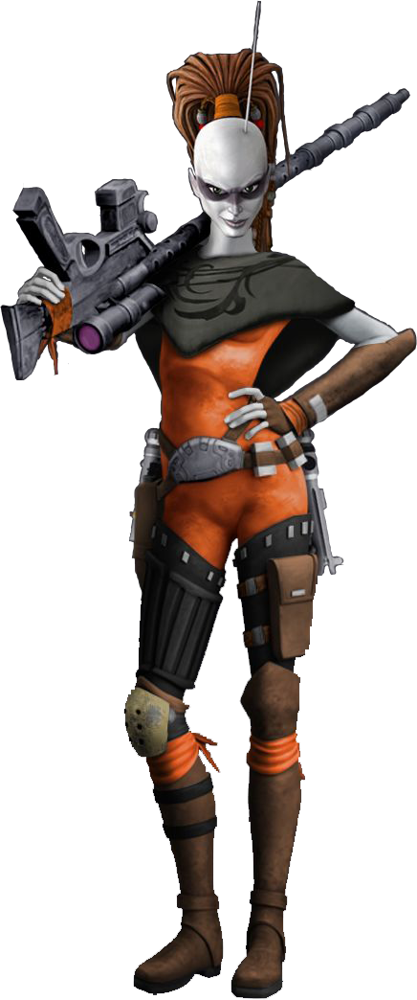

# Deadeye Technique

Some scouts become legends written in blaster burns. Followers of the Deadeye Technique perfect the art of the blaster shot and utilize their incredible focus to make shots that most would deem impossible. When everything depends on one shot, you want a Deadeye pulling the trigger.

Due to their uncanny focus, Deadeyes can make shots that other marksmen would never dare to attempt. Deadeyes know how to make the most of ranged weapons and can use them to greater effect than other Scouts.

## Deadeye Superiority
_**Deadeye Technique:** 3rd level_ 
You learn maneuvers that are fueled by special dice called superiority dice. See chapter 13 for the maneuvers list.

### Maneuvers Known
You learn two maneuvers of your choice, and you earn more at higher levels, as shown in the Maneuvers Known column of the Deadeye Superiority table. Many maneuvers enhance an attack in some way. You can use only one maneuver per attack, and you may only use each maneuver once per turn.

Each time you learn new maneuvers, you can also replace one maneuver you know with a different one.

### Superiority Dice
You have two superiority dice, which are d4s, and you earn more at higher levels, as shown in the Superiority Dice Quantity column of the Deadeye Superiority table. This die changes as you gain scout levels, as shown in the Superiority Dice Size column of the Deadeye Superiority table. A superiority die is expended when you use it. 

You regain all of your expended superiority dice when you finish a short or long rest.

### Maneuver Ability
Your maneuver ability varies based on the type of the maneuver you use. You use Strength, Dexterity, or Constitution for physical maneuvers (your choice), Intelligence, Wisdom, or Charisma for mental maneuvers (your choice), and an ability of your choice for general maneuvers. You use this ability whenever a maneuver refers to your maneuver ability. Additionally, you use this ability modifier when setting the saving throw DC for a maneuver you use.

___

**Maneuver save DC** = 8 + your proficiency bonus + your maneuver ability modifier

___

### Deadeye Superiority

|Level|Maneuvers Known|Superiority Dice Quantity|Superiority Dice Size|
|:--:|:--:|:--:|:--:|
| 3rd| 2|2| d4|
| 4th| 2|2| d4|
| 5th| 4|3| d6|
| 6th| 4|3| d6|
| 7th| 5|3| d6|
| 8th| 5|3| d6|
| 9th| 6|4| d8|
|10th| 6|4| d8|
|11th| 7|4| d8|
|12th| 7|4| d8|
|13th| 9|5|d10|
|14th| 9|5|d10|
|15th|10|5|d10|
|16th|10|5|d10|
|17th|11|6|d12|
|18th|11|6|d12|
|19th|12|6|d12|
|20th|12|6|d12|

## Mark of the Deadeye
_**Deadeye Technique:** 3rd level_ 
The range of your Ranger's Quarry feature doubles. Additionally, when making ranged weapon attacks against the target of your Ranger's Quarry, the normal and long range of your blaster weapons double.

## Cover to Cover
_**Deadeye Technique:** 7th level_ 
Attack rolls made against you on your turn are made with disadvantage.

## Shoot First
_**Deadeye Technique:** 11th, 13th, and 17th level_ 
You have learned that the person who shoots first is often the one who walks out alive. When you make a ranged weapon attack against a creature that has not yet acted during your first turn in combat and you have advantage on the roll, you can reroll one of the dice once. Additionally, on a hit, you deal an extra 1d8 damage of the same type as the weapon. This damage increases to 1d10 at 13th level and 1d12 at 17th level.

## Overwatch
_**Deadeye Technique:** 15th level_ 
You have become a master at protecting your allies from afar. When a creature attempts to make an opportunity attack against an allied creature, or forces your ally to make a saving throw, you can use your reaction to make an attack roll against the enemy creature. 

If your attack hits, either impose disadvantage on the enemy creature's opportunity attack roll or grant advantage to any allies making the saving throw.
