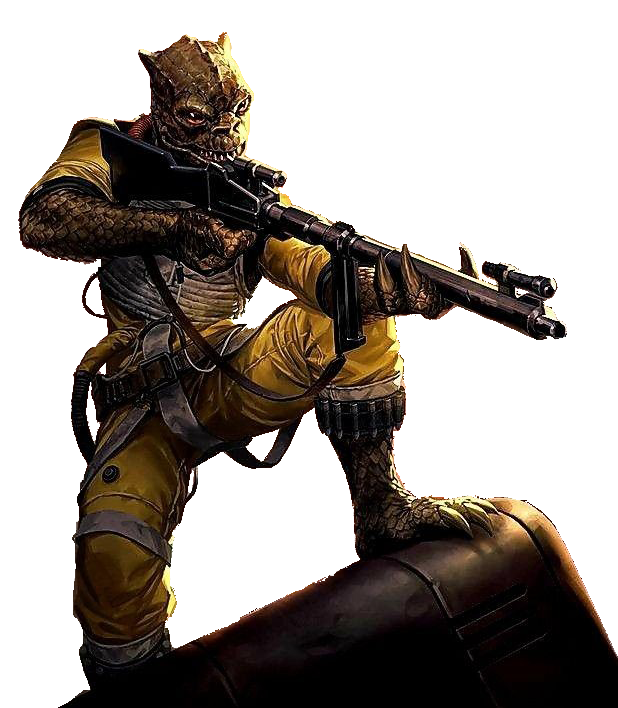

# Predator Technique

Some scouts work in solitude, while others prefer the strength of a group. Followers of the Predator Technique find power lies with the pack; they distract their prey, while their allies go for the kill.

## Bonus Proficiencies
_**Predator Technique:** 3rd level_ 
You gain proficiency in heavy armor.

## Hunting Party
_**Predator Technique:** 3rd, 5th, 9th, 13th, and 17th level_ 
When you take the Attack action on your turn, you can use a bonus action to direct one of your companions to strike. When you do so, choose a friendly creature who can see or hear you. That creature can immediately use its reaction to make one weapon attack.

You can use this feature twice. You gain an additional use at 5th, 9th, 13th, and 17th level. You regain all expended uses of it when you finish a long rest.

## Mark of the Predator
_**Predator Technique:** 3rd level_ 
If the target of your Ranger's Quarry feature can see you, a number of friendly creatures you choose up to your Intelligence modifier have advantage on Dexterity (Stealth) checks made to hide from it.

## Predator's Resolve
_**Predator Technique:** 7th level_ 
You can use your action to gain the following benefits for 1 minute:
- You have advantage on Constitution saving throws.
- At the start of each of your turns, you gain temporary hit points equal to your Constitution modifier (minimum of one).
- When you use your Hunting Party feature and the target of the attack is your Ranger's Quarry, your ally gains a bonus to damage on the attack equal to your Ranger's Quarry Damage Die.

Once you've used this feature, you can't use it again until you finish a short or long rest.

## Prey on the Weak
_**Predator Technique:** 11th level_ 
When you hit a creature with a weapon attack, and the creature is below its hit point maximum, the next attack roll made against that creature before the end of your next turn by someone other than you has advantage.

## On the Hunt
_**Predator Technique:** 15th level_ 
When you use your Predator's Resolve feature, a number of friendly creatures you choose up to your Intelligence modifier that you can see within 30 feet of you also gain the benefits of the feature.
