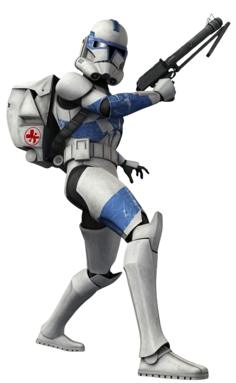

# Triage Technique

With every conflict comes death and destruction. Followers of the Triage Technique excel at keeping their comrades in the fight with quick thinking and fast-acting medicine.

## Triage Training
_**Triage Technique:** 3rd level_ 
You gain proficiency in the Medicine skill. 

Additionally, when you would use your action to make an ability check to stabilize a creature, expend a use of a traumakit, or use a medpac, you can instead use your bonus action.

## Mark of Triage 
_**Triage Technique:** 3rd level_ 
You learn new ways to use your Ranger's Quarry. 
- While a hostile creature is the target of your Ranger's Quarry, you always know any conditions it is suffering from, and you know at roughly what percentage its current hit points is relative to its maximum. Additionally, if the target is within 60 feet of you, when it is forced to make a Constitution saving throw, you can use your reaction to force it to make the roll with disadvantage. Once you've used this feature, you must complete a short or long rest before you can use it again.
- While a friendly creature is the target of your Ranger's Quarry, you have advantage on Wisdom (Medicine) checks made to stabilize it. Additionally, if the target is within 60 feet of you, you can use your bonus action and roll your Ranger's Quarry and either restore hit points equal to the amount rolled, or grant temporary hit points equal to the amount rolled. Once a friendly creature has benefited from this ability, they can not do so again until they complete a short or long rest.

## Double Dose
_**Triage Technique:** 7th, 9th, 13th, and 17th level_ 
Your application of medicine does not interfere with your own ability to recover from injuries. When you restore hit points or grant temporary hit points to another creature with a tech power or class feature, you recover the same amount of hit points or gain the same number of temporary hit points. 

You can use this feature three times. You gain an additional use at 9th, 13th, and 17th level. You regain all expended uses when you complete a long rest.

## Experimental Infusion
_**Triage Technique:** 11th level_ 
When you target a creature with your Ranger's Quarry, you can grant one of the following additional effects of your choice:
- ***Adrenaline/Tranquilizer.*** The creature's movement speed is doubled until the end of its next turn. Alternatively, it gains a level of slowed until the end of its next turn.

- ***Focus/Dizziness.*** The creature has either advantage or disadvantage (your choice) on the first ability check, attack roll, or saving throw it makes within the next minute.
- ***Toughen/Weaken.*** The creature gains temporary hit points equal to your scout level, which last for 1 minute. Alternatively, the creature must make a Constitution saving throw against your tech save DC. On a failure, it takes psychic damage equal to your scout level and it can't regain hit points until the start of your next turn.

You can use each feature once. You regain any expended uses when you complete a short or long rest.

## Cure-All
_**Triage Technique:** 15th level_ 
Your healing becomes even more potent. When you restore hit points or grant temporary hit points to a creature as a bonus action using your Mark of Triage feature, you can also end one of the following conditions afflicting it: blinded, deafened, diseased, paralyzed, or poisoned.
