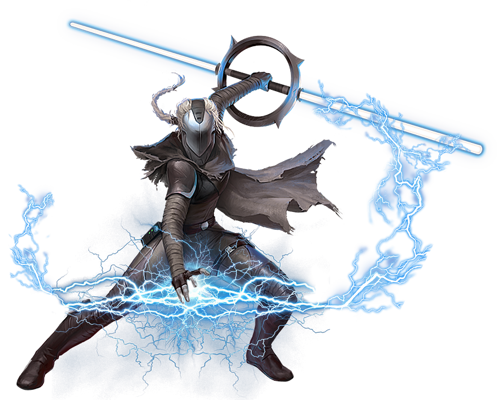

# Path of Aggression

From the murky depths of the dark side comes seething fury. Those sentinels who follow the Path of Aggression charge their weapon with lightning, culminating in a massive discharge that can ravage their opponents.

## Voltaic Slash
_**Path of Aggression:** 3rd level_ 
Starting when you choose this calling at 3rd level, you learn the *lightning charge* force power, which does not count against your total powers known. Additionally, you can use Wisdom or Charisma as your forcecasting ability for it, and when you deal lightning damage with the *lightning charge* force power, you deal additional lightning damage equal to half your Wisdom or Charisma modifier (your choice, minimum of one) if it doesn't already include that modifier.

## Thunderous Momentum
_**Path of Aggression:** 3rd level_ 
Your stride becomes nigh unbreakable. You are immune to the shocked condition, and each slowed level only reduces your speed by 5 feet, unless it would reduce your speed to 0.

## Entropic Rush
_**Path of Aggression:** 7th level_ 
You've learned to move with speed and precision, discharging your lightning in a massive burst. When you move at least half your speed before casting *lightning charge*, you make the attack roll with advantage. Additionally, on a hit, the lightning can leap a second time, to a third creature within range or back to the first creature.

## Living Current
_**Path of Aggression:** 13th level_ 
You've learned to channel the damage done to you to enhance your strikes. The first time you deal damage on your turn, if you took damage since the start of your last turn, you can deal additional lightning damage equal to your Kinetic Combat die + half the amount of damage taken.

You can use this feature five times. You gain an additional use at 17th level. You regain all expended uses when you finish a short or long rest.

## Retaliatory Strike
_**Path of Aggression:** 18th level_ 
When a creature hits you with an attack while within 5 feet of you, you can use your reaction to cast the *lightning charge* force power, targeting them.
