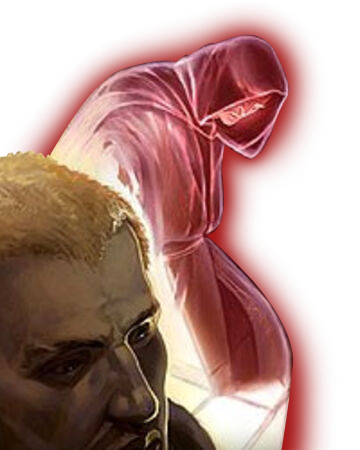

# Path of Ethereality

In the distant reaches of the galaxy obscure knowledge and forgotten secrets of the Force can sometimes be found. While other Force-sensitive may find themselves touched by this secret knowledge of the Force, those sentinels who follow the Path of Ethereality instead find themselves grabbed. Held onto by mysterious aspects of the Force that refuse to let go, these sentinels find themselves able to manipulate the universe around them.

## Aberrant Resilience
_**Path of Ethereality:** 3rd level_ 
You learn the *resistance* force power, which does not count against your total powers known. Additionally, this power no longer requires concentration for you when you target yourself with it.

## Force-Empowered Kinesis
_**Path of Ethereality:** 3rd level_ 
Your connection to the Force allows you to briefly become incorporeal. When you use a Force-Empowered Self option, until the end of your turn, you can move through other creatures and objects as if they are difficult terrain. If you end this movement inside a solid object or creature, you are immediately shunted to the nearest unoccupied space that you can occupy and take true damage equal to twice the number of feet you are moved. 

## Out of Touch
_**Path of Ethereality:** 7th level_ 
As an action, you can step out of sync with the rest of the universe for 1 minute. At the start of each of your turns, roll a d20. If you roll 11 or higher, you and everything your are wearing or carrying are completely invisible to all beings, except for those with truesight. On a roll of 10 or lower, you instead appear as an indistinguishably blurred form roughly your normal height and weight, though a being with truesight sees you normally. Regardless of your appearance, for the duration, your speed doubles, you gain a flying speed equal to your walking speed, and you can move through creatures and objects willingly though you can not affect them and they can not affect you. You can end this feature early on your turn (no action required). When this effect ends, if you are inside a solid object or creature, you are immediately shunted to the nearest unoccupied space that you can occupy and take force damage equal to twice the number of feet you are moved. 

This effect ends early if you are incapacitated or die. Once you've used this feature, you must complete a short or long rest before you can use it again.

## Event Cascade
_**Path of Ethereality:** 13th level_ 
You have advantage on attack rolls you make against creatures if you haven't dealt damage to them or affected them with a force power since the start of your previous turn.

## Aberrant Self
_**Path of Ethereality:** 18th level_ 
You no longer suffer the frailty of old age, and you can't be aged abnormally. You can still die of old age, however. Additionally, you no longer need food or water, and you no longer need to sleep. Lastly, the first time you take damage on each of your turns, you can roll your Kinetic Combat die and reduce the damage by that amount.
