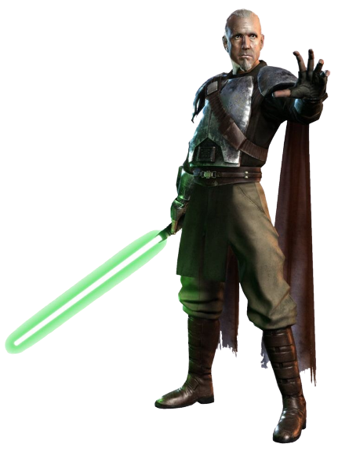

# Path of Iron 

Many sentinels choose to focus on a discipline that demands physical strength, reflexes, and fortitude. Those sentinels who follow the Path of Iron train their bodies to their physical peak, able to withstand nigh intolerable punishment and bolster their physical combat capabilities. 

## Form Combat Training
_**Path of Iron:** 3rd level_ 
You learn one lightsaber form, as detailed in the Customization Options document for Expanded Content. 

Additionally, you gain proficiency in all martial light- and vibro- weapons.

## Physical Conditioning
_**Path of Iron:** 3rd level_ 
You've undergone special training, increasing your physical capabilities. You gain the following benefits: 
- You gain proficiency in medium armor. If you are already proficient in medium armor, you then gain proficiency in heavy armor. While you are wearing light or medium armor, you can use your Wisdom or Charisma modifier (your choice) instead of your Dexterity modifier when determining your AC.
- Your hit point maximum increases by 3, and it increases by 1 again whenever you gain a level in this class.

## Enhanced Force-Empowered Self
_**Path of Iron:** 7th level_ 
Through intense physical training, you've improved your body's ability to access and channel the force flowing within you. 

When you would use a Force-Empowered Self option, you can choose to bolster the option, gaining an additional effect as listed below. You can only bolster a Force-Empowered Self option once per turn. 

You can use these features a combined three times. You gain an additional use at 9th, 13th, and 17th level. You regain any expended uses when you finish a short or long rest.

While you have no remaining uses of this feature, you can instead expend 1 force point to use it.

### Aegis
When you bolster Deflection, when an attack would hit you before the start of your next turn, you subtract the same value rolled for Deflection from the damage taken.

### Cleave
When you bolster Double Strike, you choose another creature within 5 feet of your target. They take damage of the same type equal to the result of the die rolled for Double Strike.

### Momentum
When you bolster Slow Time, until the end of your turn you ignore difficult terrain, and can move along vertical surfaces and across liquids without falling during the move.

## Follow Through
_**Path of Iron:** 13th level_ 
When you take the Attack action on your turn, you can spend 2 force points and forgo one of your attacks to cast an at-will force power which requires you to make a melee weapon attack.

## Kinetic Mastery
_**Path of Iron:** 18th level_ 
Choose a lightsaber form you know. Once on each of your turns, you can use the chosen form without using your bonus action. 

You can do so six times. You regain all expended uses when you complete a long rest.

While you have no remaining uses of this feature, you can instead expend 1 force point to use it.
