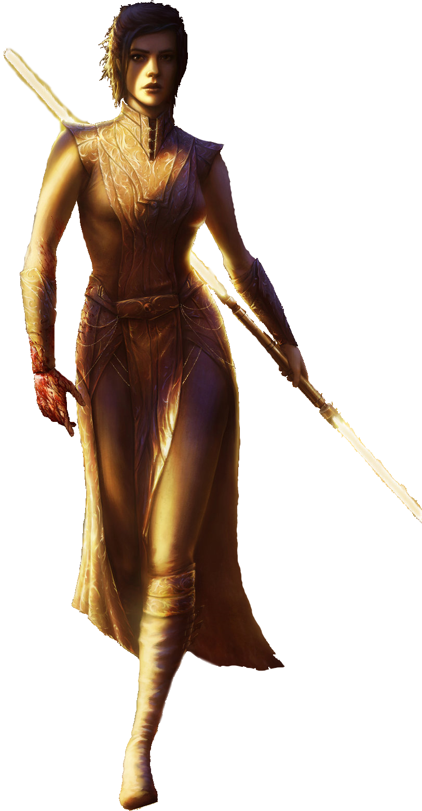

# Path of Meditation

Throughout the Force, there is both symphonic harmony, and discordant chaos. Those sentinels who follow the Path of Meditation embody these concepts, empowering their allies and hindering their enemies through the use of the ancient Force technique of battle meditation.

## Sage Counsel
_**Path of Meditation:** 3rd level_ 
You learn the *guidance* force power, which does not count against your total powers known. Additionally, this power's die increases by one step (from d4 to d6, d6 to d8, d8 to d10, or d10 to d12).

## Force-Empowered Allies
_**Path of Meditation:** 3rd level_ 
While you are concentrating on a power that benefits a friendly creature other than you, you gain new ways to utilize your Force-Empowered Self features. Each option costs 1 force point, and you can only target a creature that is benefiting from a power you cast.

### Deflection
When an ally is hit with an attack roll, you can use your reaction and roll a Kinetic Combat die to add it to your ally's AC, potentially causing the attack to miss.

### Double Strike
When an ally hits with an attack roll, you can use your reaction and roll a Kinetic Combat die to deal additional damage of the same type as the attack.

### Slow Time
When an ally moves on their turn, you can use your reaction and roll a Kinetic Combat die to increase their speed by 5 x the amount rolled until the end of the turn.

## Unbreakable Focus
_**Path of Meditation:** 7th level_ 
Once per long rest, you can cast the *battle meditation* force power at its base level without expending force points. While concentrating on *battle meditation*, at the start of each of your turns, the power's die increases by one step (from d4 to d6, d6 to d8, d8 to d10, or d10 to d12).

Additionally, whenever you make a Constitution saving throw to maintain concentration on a force power, you can treat a d20 roll of 9 or lower as a 10.

## Turbulent Presence
_**Path of Meditation:** 13th level_ 
Once per long rest, you can cast the *improved battle meditation* force power at its base level without expending force points. While concentrating on *improved battle meditation*, at the start of each of your turns, the power's die increases by one step (from d6 to d8, d8 to d10, or d10 to d12).

Additionally, once per round, when a creature rolls a bonus or penalty die from an effect you control, you can have them roll the die with advantage or disadvantage (your choice).

## Legendary Battle Meditation
_**Path of Meditation:** 18th level_ 
Once per long rest, you can cast the *master battle meditation* force power without expending force points. While concentrating on *master battle meditation*, at the start of each of your turns, the power's die increases by one step (from d8 to d10, or d10 to d12).

Additionally, you gain a second reaction each round that you can only use for your Force-Empowered Allies feature. You can only take one reaction per turn.
