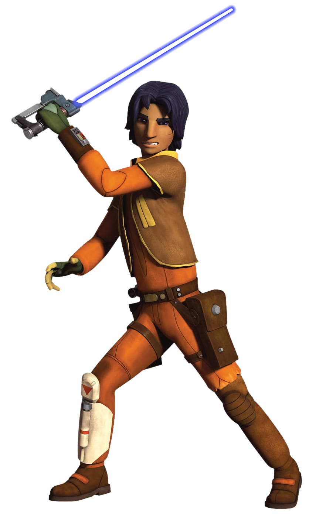

# Path of Synthesis

There is power in diversity unknown to those of narrow mind. Those sentinels who follow the Path of Synthesis blend their intricate mastery of the Force with their understanding of technology, creating unique effects to overcome their obstacles.

## Techcasting Secrets
_**Path of Synthesis:** 3rd level_ 
You have learned to intersperse your training with an aptitude for technology. Choose two tech powers of 1st level or lower. The chosen powers count as universal force powers for you, but are not included in the number in the Powers Known column of the sentinel table. 

At 7th level, you learn two tech powers of 2nd level or lower. At 13th level, you learn two tech powers of 3rd level or lower. At 17th level, you learn two tech powers of 4th level or lower. Whenever you gain a level in this class, you can choose one of the tech powers you know and replace it with another tech power of no higher than the level determined by this feature.

## Synthetic Understanding
_**Path of Synthesis:** 3rd level_ 
You've applied your newfound knowledge to broader pursuits. You gain proficiency in Technology or one tool of your choice.

Additionally, when you make an Intelligence (Technology) check, or a check with a tool, you may use your Wisdom or Charisma modifier (your choice) instead of your Intelligence modifier.

Finally, when you deal damage with a tech power or your Double Strike Force Empowered Self option, you can choose to substitute the damage dealt as ion.

## Force-Empowered Tech
_**Path of Synthesis:** 7th, 9th, 13th, and 17th level_ 
You learn to fully blend your technological aptitude with your use of the Force. You have three such effects: Disruption Pulse, Force Override, and Techcasting Insight. When you use your Force-Empowered Tech, you choose which effect to create.

You can use this feature three times. You gain an additional use at 9th, 13th, and 17th level. You regain all expended uses when you finish a short or long rest.

### Disruption Pulse
As an action, you can send out a 30 foot cone of electromagnetically-charged energy to overload enemy weapons. Each creature within the cone that is wearing or carrying a weapon with electric components must make an Intelligence saving throw. If the weapon is being worn, this save is made with disadvantage. On a failed save, the first attack they attempt to make with that weapon has disadvantage. A creature with multiple weapons must make a separate save for each weapon.

### Forced Override
When you cast a tech power that requires a saving throw, you can impose disadvantage on the save (no action required).

### Techcasting Insight
As an action, you can attempt to determine another creature's experience with techcasting. When you do so, you make an Intelligence (Technology) check contested by the target's Intelligence (Technology) check. If you succeed, you immediately learn the target's techcasting Max Power Level, as well as any tech powers currently affecting the target.

## Improved Force-Empowered Tech
_**Path of Synthesis:** 13th level_ 
You've gained access to two additional Force-Empowered Tech effects: Harmonic Synthesis and Conservation of Energy.

### Harmonic Synthesis
When you use your action to cast a force power, you can use your bonus action to gain resistance to damage dealt by tech powers until the start of your next turn. If you use your action to cast a tech power, you can instead gain resistance to damage dealt by force powers.

### Conservation of Energy
When you reduce a hostile creature to 0 hit points with a tech power, you can reduce the force point cost of the tech power to 0 (no action required).

## Reflective Shield
_**Path of Synthesis:** 18th level_ 
When you use your Force-Empowered Tech features, a barrier for energy shimmers into existence, surrounding you until the end of your next turn. When you take damage, you can mitigate the incoming energy and potentially reflect it back at your attacker. You use your reaction to have resistance against the triggering damage, and if the source of the damage is within 5 feet of you, they take half of the total damage dealt as ion.
